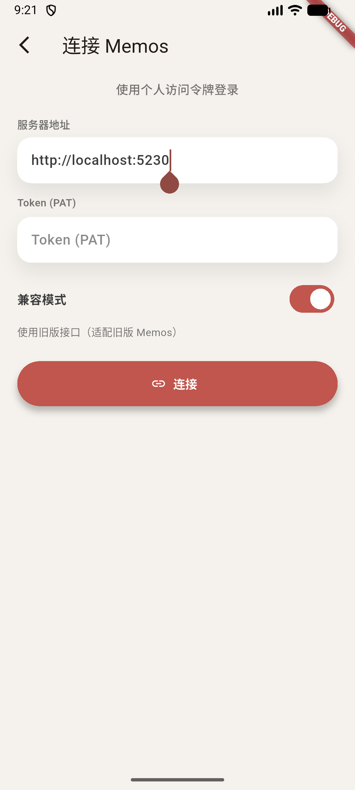
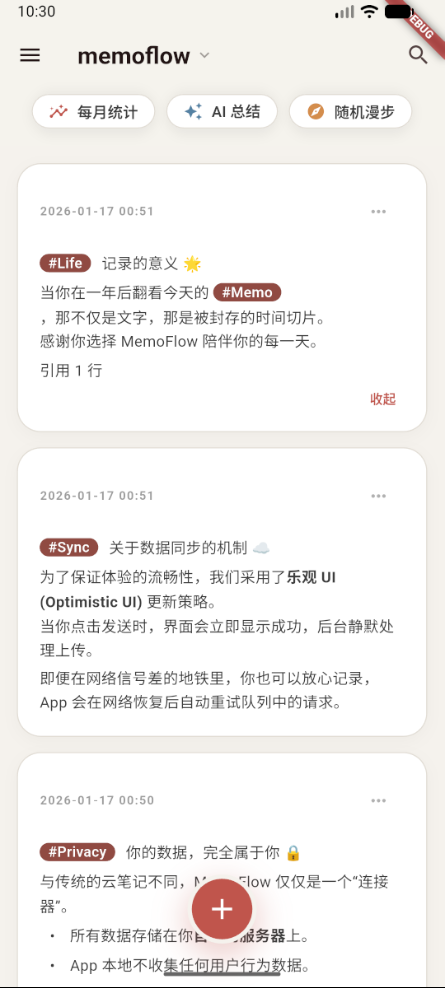
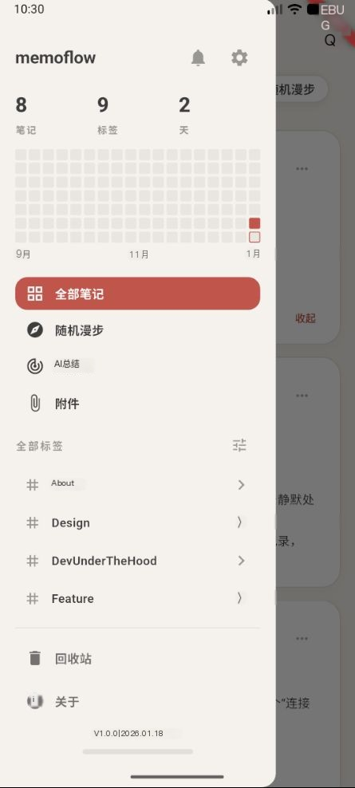
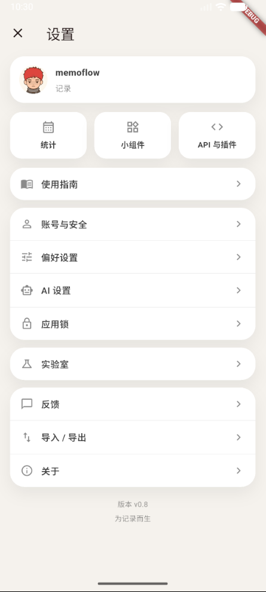

# MemoFlow
# 请求帮助 | Request help [#65](https://github.com/hzc073/memoflow/issues/65)
English version: [README_EN.md](README_EN.md)

MemoFlow 是一个面向 [memos](https://github.com/usememos/memos) 后端的 Flutter 移动端客户端。本项目为独立的第三方客户端，
与 Memos 官方项目没有任何关系。

## 功能
- 离线优先：本地 SQLite 缓存 + Outbox 重试队列。
- 支持 Markdown、标签和任务清单的 Memo 新建、编辑、搜索、置顶、归档与删除。
- 快速输入：草稿保存、标签建议、双链引用、附件、拍照，以及撤销/重做。
- 附件浏览：图片预览、音频播放、语音备忘录录制。
- 随机复盘与本地统计（按月图表/热力图），支持分享。
- AI 总结报告：可配置 Provider/Model/Prompt，支持分享海报或保存为 Memo。
- 多账号 PAT 登录，支持旧版 Memos 的兼容模式。
- 小组件、应用锁、偏好设置（主题/语言/字体）、Markdown+ZIP 导出。

## 待办事项
- 用户
  - 认证
    - [x] PAT 登录
  - 账号信息
    - [x] 查看账号信息
    - [x] 编辑账号信息
    - [x] Webhook 管理
- Memo
  - 基础
    - [x] 新建/编辑/搜索/置顶/归档/删除
  - Markdown
    - [x] 基础渲染:标题、引用、分割线、加粗、斜体、行内代码、代码块、无序/有序列表、链接、图片
    - [x] 自定义扩展渲染：删除线、任务列表、表格、脚注、高亮、下划线用内联 HTML
    - [ ] LaTeX公式
  - 附件
    - [x] 附件浏览
    - [x] 图片预览
    - [x] 音频播放
    - [ ] 附件编辑
  - 互动
    - [x] 点赞/评论
- 其他
  - [x] 离线优先同步
  - [ ] 单机模式
  - [x] AI 总结
  - [ ] 语音转文字
  - [ ] 自定义快速工具
  - [x] 任务事项进度条
  - [ ] 多语言（对齐 Memos 后端语言包，33 项）
    - [ ] `ar` 阿拉伯语
    - [ ] `ca` 加泰罗尼亚语
    - [ ] `cs` 捷克语
    - [x] `de` 德语
    - [x] `en` 英语
    - [ ] `en-GB` 英式英语
    - [ ] `es` 西班牙语
    - [ ] `fa` 波斯语
    - [ ] `fr` 法语
    - [ ] `gl` 加利西亚语
    - [ ] `hi` 印地语
    - [ ] `hr` 克罗地亚语
    - [ ] `hu` 匈牙利语
    - [ ] `id` 印度尼西亚语
    - [ ] `it` 意大利语
    - [x] `ja` 日语
    - [ ] `ka-GE` 格鲁吉亚语
    - [ ] `ko` 韩语
    - [ ] `mr` 马拉地语
    - [ ] `nb` 挪威博克马尔语
    - [ ] `nl` 荷兰语
    - [ ] `pl` 波兰语
    - [ ] `pt-PT` 葡萄牙语（葡萄牙）
    - [ ] `pt-BR` 葡萄牙语（巴西）
    - [ ] `ru` 俄语
    - [ ] `sl` 斯洛文尼亚语
    - [ ] `sv` 瑞典语
    - [ ] `th` 泰语
    - [ ] `tr` 土耳其语
    - [ ] `uk` 乌克兰语
    - [ ] `vi` 越南语
    - [x] `zh-Hans` 简体中文
    - [x] `zh-Hant` 繁体中文（当前实现：`zh-Hant-TW`）

## 截图
**登录**

**首页**

**导航栏**

**设置**

## 数据与隐私
- PAT 通过 `flutter_secure_storage` 存储。
- Memo 缓存在本地 SQLite，并通过 Outbox 队列进行同步。
- AI 总结会将选中的 Memo 内容发送至配置的 AI Provider，不会同步到 Memos 后端。

## 说明
- 导出格式为 Markdown 文件打包的 ZIP（暂未支持导入）。
- 若遇到同步问题，可开启网络日志并在应用内导出诊断信息。

# 致谢
Memos https://github.com/usememos/memos
