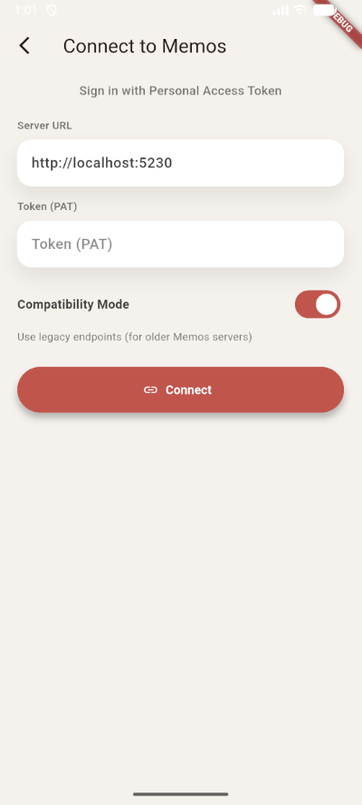
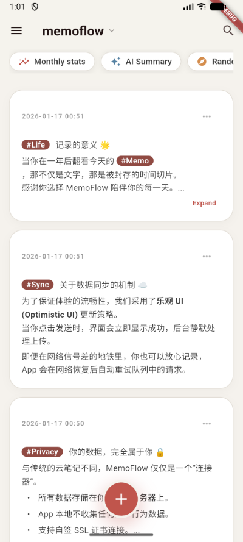
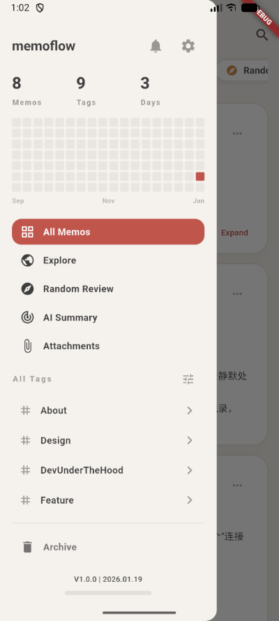
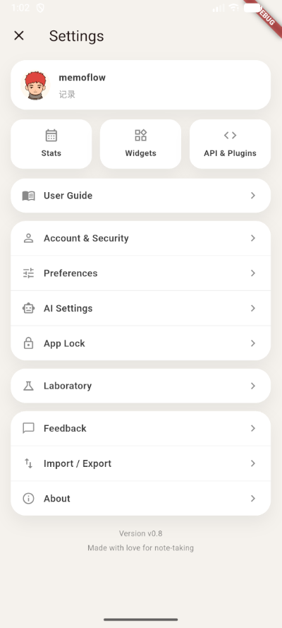
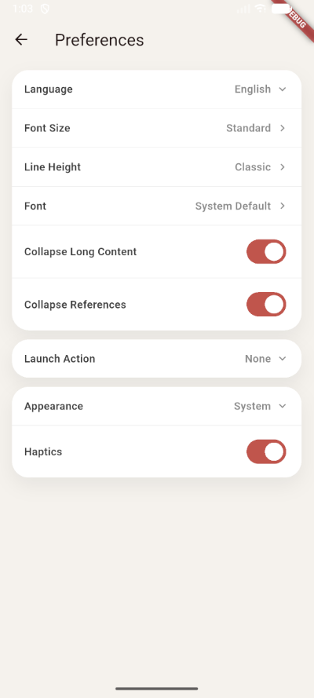
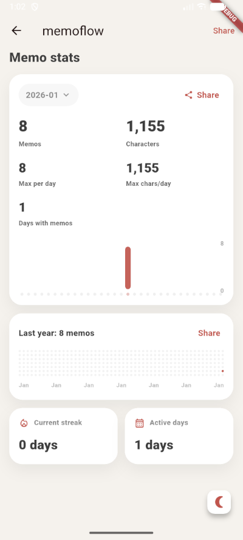

# MemoFlow

Chinese version: [README.md](README.md)

MemoFlow is a Flutter mobile client for the[memos](https://github.com/usememos/memos) backend. It is an independent, third-party
project and is not affiliated with or endorsed by the official Memos project.

## Features
- Offline-first sync with local SQLite storage and an outbox queue for retries.
- Create, edit, search, pin, archive, and delete memos with Markdown, tags, and tasks.
- Quick input sheet with drafts, tag suggestions, memo links, attachments, camera capture, and undo/redo.
- Attachments browser with image preview and audio playback; voice memo recording.
- Random daily review and local stats (monthly charts and activity heatmap) with sharing.
- AI summary reports with configurable provider/model/prompt; share poster or save as memo.
- Multi-account PAT login plus legacy API compatibility mode for older Memos servers.
- Widgets, app lock, preferences (theme, language, fonts), and Markdown+ZIP export.

## TODO
- User
  - Auth
    - [x] Login with PAT
    - [ ] Login with password
  - Account
    - [x] View account info
    - [ ] Edit account info
    - [ ] Webhook management
- Memos
  - Basics
    - [x] Create/edit/search/pin/archive/delete memos
    - [x] Comment on memos
  - Markdown
    - [x] Basic rendering
    - [x] Task lists
    - [x] Code blocks with syntax highlighting
  - Attachments
    - [x] Browse attachments
    - [x] Image preview
    - [x] Audio playback
    - [ ] Edit attachments
  - Reactions
    - [x] Add/remove reactions
- Misc
  - [x] Offline-first sync
  - [x] AI summary
  - [x] Multi-language (Chinese/English)

## Compatibility
- Uses Memos API v1 by default.
- Enable Compatibility Mode for legacy endpoints when connecting to older servers.

## Screenshots
**Login**

**Home**

**Navigation**

**Settings**

**Preferences**

**Share**

## Data and privacy
- Personal Access Tokens are stored via `flutter_secure_storage`.
- Memos are cached in a local SQLite database and synced via an outbox queue.
- AI summary sends selected memo content to the configured AI provider; it is not synced to the Memos backend.

## Notes
- Export outputs Markdown files inside a ZIP archive (import is not implemented yet).
- If you run into sync issues, enable network logging and export diagnostics from the app.
