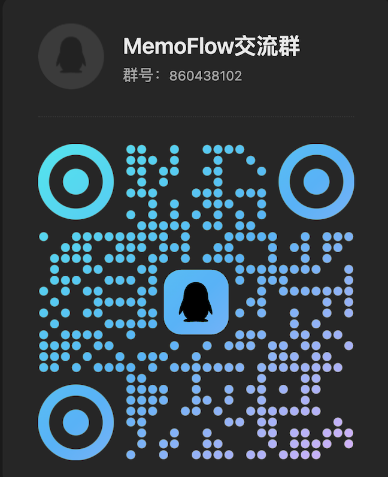
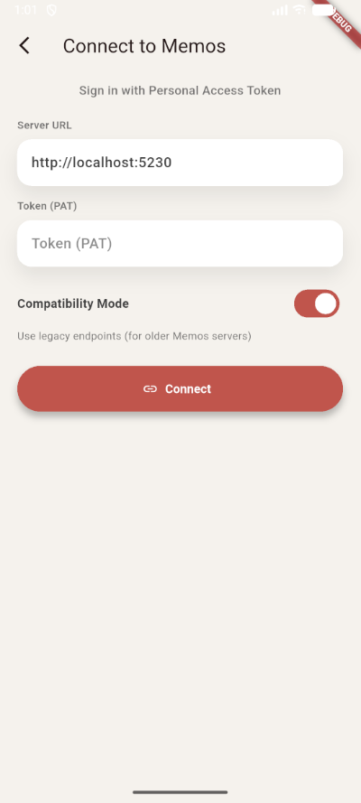
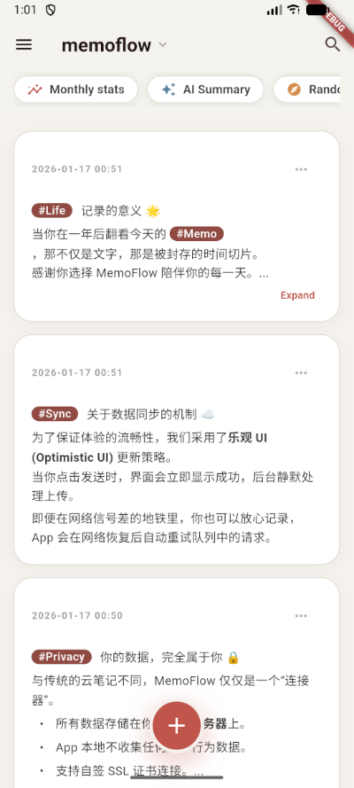
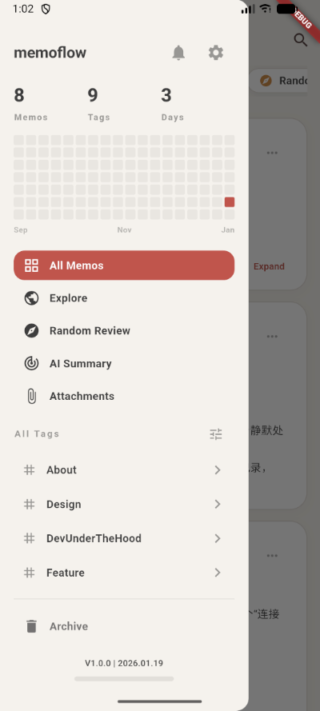
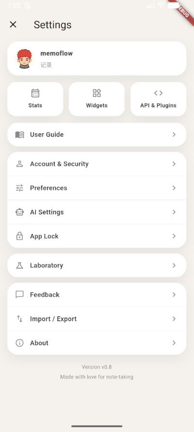

# MemoFlow

  

  <a href="README.md">Chinese</a> |
  <a href="https://memoflow.hzc073.com/">Official website</a> |
  <a href="https://memoflow.hzc073.com/help/">Help Center</a>

MemoFlow is a Flutter mobile client for the [memos](https://github.com/usememos/memos) backend.

> This project is an independent third-party client
> and has no affiliation with the official Memos project.

## Download

  &nbsp;
  &nbsp;
  

## Community
- QQ group: `860438102`

  

## Features
- Login and version compatibility: supports username/password and PAT login, with Memos API version selection and probing before login (0.21-0.29).
- Offline-first: local SQLite cache + outbox retry queue, with sync queue viewing and retry support.
- Complete memo workflow: create, edit, search, pin, archive, delete, filter by tags, and browse Explore.
- Markdown and task lists: supports common Markdown rendering, task list progress display, backlinks, and linked navigation.
- Multimedia input and preview: supports attachment upload, camera capture, voice recording, image/audio/video preview, and downloads.
- Version history and trash: supports viewing/restoring memo history versions, plus restoring or permanently deleting from trash.
- Reminder system: supports memo reminders, test reminders, do-not-disturb windows, ringtone/vibration, and other reminder settings.
- Import and export: supports Markdown+ZIP export and flomo/Markdown ZIP import.
- Local library mode: supports adding and scanning local libraries, with coexistence and switching alongside server mode.
- WebDAV capabilities: supports WebDAV sync, backup/restore, retention policies, and recovery code flow.
- AI and review statistics: supports AI summaries, random reviews, statistics, and heatmap display.
- Experience and personalization: supports notification center, widgets, app lock, theme/language/font preferences, and more.

## TODO
- User
  - Authentication
    - [x] PAT login
  - Account info
    - [x] View account info
    - [x] Edit account info
    - [x] Webhook management
- Memo
  - Basics
    - [x] Create/edit/search/pin/archive/delete
  - Markdown
    - [x] Basic rendering: headings, quotes, horizontal rules, bold, italic, inline code, code blocks, unordered/ordered lists, links, images
    - [x] Custom extensions: strikethrough, task lists, tables, footnotes, highlight, underline via inline HTML
    - [x] LaTeX formulas
  - Attachments
    - [x] Browse attachments
    - [x] Image preview
    - [x] Audio playback
    - [x] Edit attachments
  - Interaction
    - [x] Likes/comments
- Other
  - [x] Offline-first sync
  - [x] Draft box
  - [x] Standalone mode
  - [x] AI summary
  - [ ] Speech-to-text
  - [x] Custom quick tools
  - [x] Task progress bar
  - [ ] Multi-language
    

    
Language list (click to expand)

    - [ ] `ar` Arabic
    - [ ] `ca` Catalan
    - [ ] `cs` Czech
    - [x] `de` German
    - [x] `en` English
    - [ ] `en-GB` English (UK)
    - [ ] `es` Spanish
    - [ ] `fa` Persian
    - [ ] `fr` French
    - [ ] `gl` Galician
    - [ ] `hi` Hindi
    - [ ] `hr` Croatian
    - [ ] `hu` Hungarian
    - [ ] `id` Indonesian
    - [ ] `it` Italian
    - [x] `ja` Japanese
    - [ ] `ka-GE` Georgian
    - [ ] `ko` Korean
    - [ ] `mr` Marathi
    - [ ] `nb` Norwegian Bokmål
    - [ ] `nl` Dutch
    - [ ] `pl` Polish
    - [ ] `pt-PT` Portuguese (Portugal)
    - [x] `pt-BR` Portuguese (Brazil)
    - [ ] `ru` Russian
    - [ ] `sl` Slovenian
    - [ ] `sv` Swedish
    - [ ] `th` Thai
    - [ ] `tr` Turkish
    - [ ] `uk` Ukrainian
    - [ ] `vi` Vietnamese
    - [x] `zh-Hans` Chinese (Simplified)
    - [x] `zh-Hant` Chinese (Traditional, current app locale: `zh-Hant-TW`)

    

## Screenshots

  
  
  
  

## Star History

# Acknowledgments
- [Memos](https://github.com/usememos/memos)
- [MoeMemos](https://github.com/mudkipme/MoeMemos)
